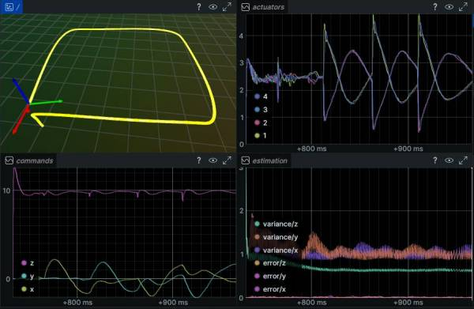

# Autopilot Portfolio

My personal portfolio project showcasing an autopilot system developed using
modern C++.

## Overview

At the time of its creation, this autopilot system includes implementations of a
few baseline algorithms that I believe should be uniformly taught to UAV
engineers:

- [**Error-State Kalman Filter (ESKF)**](www.iri.upc.edu/people/jsola/JoanSola/objectes/notes/kinematics.pdf)
  for state estimation.
- [Geometric Controller](https://hybrid-robotics.berkeley.edu/publications/CDC2013.pdf)
  for tracking control.
- [Polynomial Trajectory generation](https://groups.csail.mit.edu/rrg/papers/Richter_ISRR13.pdf)
  with _closed-form minimum snap_ optimization for path planning (WIP as of
  2026-01-09).
- Quadrotor simulator, mechanically no simpler than
  [RotorS](https://github.com/ethz-asl/rotors_simulator), but unburdened by the
  plugin architecture.

