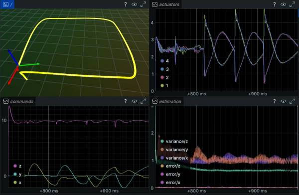

# Autopilot Portfolio

[](https://github.com/Hs293Go/autopilot/actions/workflows/cmake-linux.yml)

My personal portfolio project showcasing an autopilot system developed using
modern C++.

## Overview

At the time of its creation, this autopilot system includes implementations of a
few baseline algorithms that I believe should be uniformly taught to UAV
engineers:

- [**Error-State Kalman Filter (ESKF)**](www.iri.upc.edu/people/jsola/JoanSola/objectes/notes/kinematics.pdf)
  for state estimation.
- [Geometric Controller](https://hybrid-robotics.berkeley.edu/publications/CDC2013.pdf)
  for tracking control.
- [Polynomial Trajectory generation](https://groups.csail.mit.edu/rrg/papers/Richter_ISRR13.pdf)
  with _closed-form minimum snap_ optimization for path planning (WIP as of
  2026-01-09).
- Quadrotor simulator, mechanically no simpler than
  [RotorS](https://github.com/ethz-asl/rotors_simulator), but unburdened by the
  plugin architecture.

## Building

### Prerequisites

**Compiler**: We require a modern C++ compiler that supports C++23 features. We
have tested:

| OS Version   | Compiler Version |
| ------------ | ---------------- |
| Ubuntu 22.04 | GCC 12           |
| Ubuntu 24.04 | GCC >13          |

Install these compilers on a debian-based system with:

```bash
sudo apt-get update
sudo apt-get install build-essential g++-12 # Or 13
```

Then, set the `CXX` environment variable when building:

```bash
export CXX=g++-12
```

> [!NOTE]
>
> If you accept using a newer compiler as the default, you can set the
> alternatives system to point `g++` to the newer version. For example, to set
> `g++` to point to `g++-12`:
>
> ```bash
> sudo update-alternatives --install /usr/bin/g++ g++ /usr/bin/g++-12 100
> ```

**CMake**: We require CMake version 3.20 or higher to build the project. On a
debian-based system, visit [Kitware's APT repository](https://apt.kitware.com/)
and follow the instructions there to add the repository. Or run:

```bash
sudo bash -c $(curl -fsSL https://apt.kitware.com/kitware-archive.sh)
```

Then install cmake:

```bash
sudo apt-get update
sudo apt-get install cmake
```

> [!WARNING]
>
> If you have ROS on your system, pin the CMake version below 4.0 to maintain
> compatibility with versions of CMake older than 3.5, which is required by ROS.
> For example, create a file named `/etc/apt/preferences.d/cmake` with the
> following content:
>
> ```yaml
> Package: cmake
> Pin: version 3.*
> Pin-Priority: 1001
>
> Package: cmake-data
> Pin: version 3.*
> Pin-Priority: 1001
> ```

**Ninja**: We prefer the Ninja build system over make for faster builds. Install
it with:

```bash
sudo apt-get install ninja-build
```

### Optional Dependencies

While we automatically fetch and build all dependencies using CMake's
FetchContent, you can choose to install dependencies on the system for faster
builds. You may do so by running:

```bash
sudo apt-get update
sudo apt-get install libeigen3-dev \
  nlohmann-json3-dev \
  libspdlog-dev \
  libboost-math-dev
```

## Building the Project

To build the project, run the following commands in the root directory of the
repository:

```bash
cmake --preset=linux-default
cmake --build --preset=build-debug # Or build-release
```

## Running the Simulation

To run the simulation, you need the `rerun` visualizer on your system. If you
have Rust installed, you can install it with:

```bash
cargo install --locked rerun
```

Otherwise, if you have python installed, you can install it with:

```bash
python3 -m venv simulation_venv
source simulation_venv/bin/activate
python3 -m pip install rerun-sdk
```

After installing `rerun`, you can execute the following command after building:

```bash
../build/linux-default/examples/Debug/cascade_controller_sim
```



## Configuring the simulation

The simulation can be configured by editing the
`examples/config/cascade_controller_sim.json` file. This file contains
parameters for the simulation.
